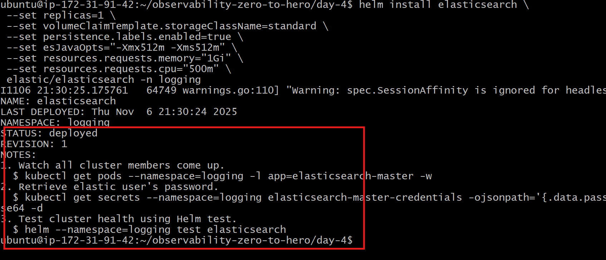

# 🔍 Logging overview
- Logging is crucial in any distributed system, especially in Kubernetes, to monitor application behavior, detect issues, and ensure the smooth functioning of microservices.


## 🚀 Importance:
- **Debugging**: Logs provide critical information when debugging issues in applications.
- **Auditing**: Logs serve as an audit trail, showing what actions were taken and by whom.
- **Performance** Monitoring: Analyzing logs can help identify performance bottlenecks.
- **Security**: Logs help in detecting unauthorized access or malicious activities.

## 🛠️ Tools Available for Logging in Kubernetes
- 🗂️ EFK Stack (Elasticsearch, Fluentbit, Kibana)
- 🗂️ EFK Stack (Elasticsearch, FluentD, Kibana)
- 🗂️ ELK Stack (Elasticsearch, Logstash, Kibana)
- 📊 Promtail + Loki + Grafana

## 📦 EFK Stack (Elasticsearch, Fluentbit, Kibana)
- EFK is a popular logging stack used to collect, store, and analyze logs in Kubernetes.
- **Elasticsearch**: Stores and indexes log data for easy retrieval.
- **Fluentbit**: A lightweight log forwarder that collects logs from different sources and sends them to Elasticsearch.
- **Kibana**: A visualization tool that allows users to explore and analyze logs stored in Elasticsearch.

# 🏠 Architecture


## 📝 Step-by-Step Setup


```bash
kubectl get storageclass
```


### 4) Create Namespace for Logging
```bash
kubectl create namespace logging
```

### 5) Install Elasticsearch on K8s

```bash
helm repo add elastic https://helm.elastic.co
helm repo update


helm install elasticsearch \
 --set replicas=1 \
 --set volumeClaimTemplate.storageClassName=standard \
 --set persistence.labels.enabled=true \
 --set esJavaOpts="-Xmx512m -Xms512m" \
 --set resources.requests.memory="1Gi" \
 --set resources.requests.cpu="500m" \
 elastic/elasticsearch -n logging
```


- Installs Elasticsearch in the `logging` namespace.
- It sets the number of replicas, specifies the storage class, and enables persistence labels to ensure
data is stored on persistent volumes.

### 6) Retrieve Elasticsearch Username & Password
```bash
# for username
kubectl get secrets --namespace=logging elasticsearch-master-credentials -ojsonpath='{.data.username}' | base64 -d
# for password
kubectl get secrets --namespace=logging elasticsearch-master-credentials -ojsonpath='{.data.password}' | base64 -d
```
- Retrieves the password for the Elasticsearch cluster's master credentials from the Kubernetes secret.
- The password is base64 encoded, so it needs to be decoded before use.
- 👉 **Note**: Please write down the password for future reference

### 7) Install Kibana
```bash
helm install kibana --set service.type=NodePort elastic/kibana -n logging
```
- Kibana provides a user-friendly interface for exploring and visualizing data stored in Elasticsearch.
- It is exposed as a LoadBalancer service, making it accessible from outside the cluster.

### 8) Install Fluentbit with Custom Values/Configurations
- 👉 **Note**: Please update the `HTTP_Passwd` field in the `fluentbit-values.yml` file with the password retrieved earlier in step 6: (i.e NJyO47UqeYBsoaEU)"
```bash
helm repo add fluent https://fluent.github.io/helm-charts
helm install fluent-bit fluent/fluent-bit -f fluentbit-values.yaml -n logging
```

## ✅ Conclusion
- We have successfully installed the EFK stack in our Kubernetes cluster, which includes Elasticsearch for storing logs, Fluentbit for collecting and forwarding logs, and Kibana for visualizing logs.
- To verify the setup, access the Kibana dashboard by entering the `LoadBalancer DNS name followed by :5601 in your browser.
    - `http://LOAD_BALANCER_DNS_NAME:5601`
- Use the username and password retrieved in step 6 to log in.
- Once logged in, create a new data view in Kibana and explore the logs collected from your Kubernetes cluster.


## 🧼 Clean Up
```bash

helm uninstall monitoring -n monitoring

helm uninstall fluent-bit -n logging

helm uninstall elasticsearch -n logging

helm uninstall kibana -n logging

cd day-4

kubectl delete -k kubernetes-manifest/

kubectl delete -k alerts-alertmanager-servicemonitor-manifest/


eksctl delete cluster --name observability

```
