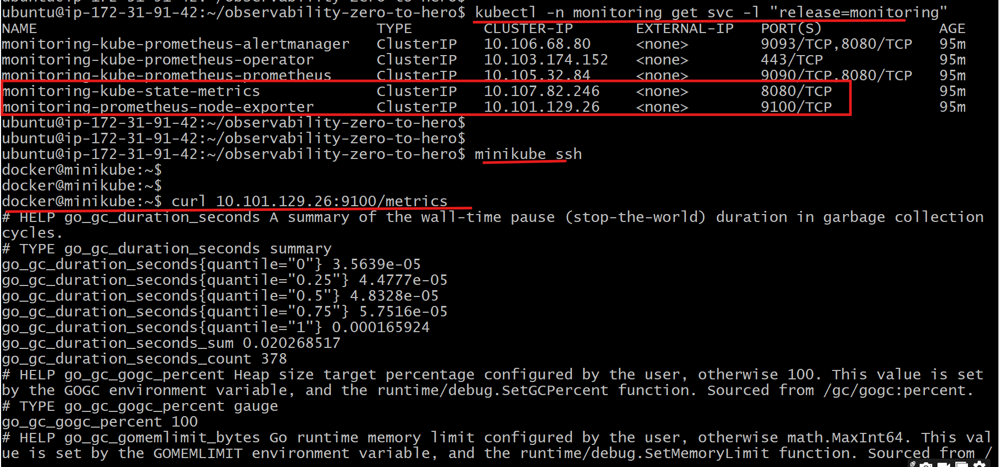

## 📊 Metrics in Prometheus:
- Metrics in Prometheus are the core data objects that represent measurements collected from monitored systems.
- These metrics provide insights into various aspects of **system performance, health, and behavior**.

## 🏷️ Labels:
- Metrics are paired with Labels.
- Labels are key-value pairs that allow you to differentiate between dimensions of a metric, such as different services, instances, or endpoints.


## 🔍 Example:
Creating a constantly crashing pod is a great way to generate metrics data for debugging and learning PromQL. Here is the complete `README.md` that outlines the process, the commands, and the resulting Prometheus queries, formatted for easy use.

-----

# 💥 Kubernetes Crash Loop Debugging with Prometheus

This guide demonstrates how to intentionally create a perpetually crashing Kubernetes Pod and how to use Prometheus and PromQL to observe the resulting instability.

-----

## 🚀 Step 1: Deploy the Crashing Pod

We deploy a container using the `busybox` image and instruct it to run the `/bin/false` command. This command immediately exits with a non-zero status code, causing the Kubernetes Kubelet to continuously restart the container (a state known as `CrashLoopBackOff`) because the restart policy is set to `Always`.

### Command

```bash
kubectl run crashing-pod --image=busybox --restart=Always -- /bin/false
```

### Verification (Kubernetes Status)

Check the Pod status immediately after creation. You will see the `RESTARTS` count quickly increase.

```bash
kubectl get pod crashing-pod
```

-----

## 🔎 Step 2: Observe Metrics (Manual Check)

Before querying Prometheus, you can manually inspect the metrics exported by the Kubelet (via cAdvisor) and Kube-State-Metrics (KSM) directly from a Node Exporter endpoint (though Node Exporter focuses on host-level data, the Kubelet/cAdvisor endpoint on the node is where container metrics originate).

While the command provided focuses on `init containers` which the `crashing-pod` doesn't have, the general idea is to manually inspect raw metrics.

### Manual Metric Inspection

If you could access the Kubelet metrics port, you would see the raw counter increase.

```bash
# This is a conceptual check, not a functional command unless Kubelet is exposed:
minikube ssh
curl <ClustIp>:port/metrics | grep kube_pod_container_status_restarts_total

 curl 10.107.82.246:8080/metrics | grep container | init_containers

```



The output would show the raw restart counter for the `crashing-pod` increasing over time.

-----

## 📊 Step 3: Query Metrics in Prometheus (PromQL)

To analyze the instability over time and confirm the `CrashLoopBackOff` state, we use PromQL in the Prometheus dashboard.

### 1\. Confirming the Crash Loop

We use the `increase()` function on the `kube_pod_container_status_restarts_total` counter metric to measure how many times the container has crashed and restarted over a specific time window (e.g., the last 5 minutes).

```promql
sum(kube_pod_container_status_restarts_total{namespace="default", pod="crashing-pod"})
increase(kube_pod_container_status_restarts_total{pod="crashing-pod", container="crashing-pod"}[5m])
```

  * **Expected Result:** A sustained, non-zero value, confirming the constant restarts.

### 2\. General Cluster State Query (Example)

Kube-State-Metrics (KSM) provides metrics about the health and state of Kubernetes objects. This query shows the creation timestamp for configuration objects in the `kube-system` namespace.

```promql
kube_configmap_created{namespace="kube-system"}
```

-----

## 💡 Key PromQL Concepts Used

| Metric/Function | Type | Purpose in Debugging |
| :--- | :--- | :--- |
| **`kube_pod_container_status_restarts_total`** | Counter | Tracks the cumulative number of container restarts. |
| **`increase(<vector>[<range>])`** | Function | Calculates the total increase in the counter's value over the given time range. This is essential for turning a raw counter into a **rate of events** (restarts in this case). |
| **Labels** (`{pod="...", container="..."}`) | Filtering | Narrows down the massive stream of metrics to target the specific unstable Pod. |

-----

```bash
container_cpu_usage_seconds_total{namespace="kube-system", endpoint="https-metrics"}
```
- `container_cpu_usage_seconds_total` is the metric.
- `{namespace="kube-system", endpoint="https-metrics"}` are the labels.


## 🛠️ What is PromQL?
- PromQL (Prometheus Query Language) is a powerful and flexible query language used to query data from Prometheus.
- It allows you to retrieve and manipulate time series data, perform mathematical operations, aggregate data, and much more.

- 🔑 Key Features of PromQL:
    - Selecting Time Series: You can select specific metrics with filters and retrieve their data.
    - Mathematical Operations: PromQL allows for mathematical operations on metrics.
    - Aggregation: You can aggregate data across multiple time series.
    - Functionality: PromQL includes a wide range of functions to analyze and manipulate data.

## 💡 Basic Examples of PromQL
- `container_cpu_usage_seconds_total`
    - Return all time series with the metric container_cpu_usage_seconds_total
- `container_cpu_usage_seconds_total{namespace="kube-system",pod=~"kube-proxy.*"}`
    - Return all time series with the metric `container_cpu_usage_seconds_total` and the given `namespace` and `pod` labels.
- `container_cpu_usage_seconds_total{namespace="kube-system",pod=~"kube-proxy.*"}[5m]`
    - Return a whole range of time (in this case 5 minutes up to the query time) for the same vector, making it a range vector.

## ⚙️ Aggregation & Functions in PromQL
- Aggregation in PromQL allows you to combine multiple time series into a single one, based on certain labels.
- **Sum Up All CPU Usage**:
    ```bash
    sum(rate(node_cpu_seconds_total[5m]))
    ```
    - This query aggregates the CPU usage across all nodes.

- **Average Memory Usage per Namespace:**
    ```bash
    avg(container_memory_usage_bytes) by (namespace)
    ```
    - This query provides the average memory usage grouped by namespace.

- **rate() Function:**
    - The rate() function calculates the per-second average rate of increase of the time series in a specified range.
    ```bash
    rate(container_cpu_usage_seconds_total[5m])
    ```
    - This calculates the rate of CPU usage over 5 minutes.
- **increase() Function:**
    - The increase() function returns the increase in a counter over a specified time range.
    ```bash
    increase(kube_pod_container_status_restarts_total[1h])
    ```
    - This gives the total increase in container restarts over the last hour.

- **histogram_quantile() Function:**
    - The histogram_quantile() function calculates quantiles (e.g., 95th percentile) from histogram data.
    ```bash
    histogram_quantile(0.95, sum(rate(apiserver_request_duration_seconds_bucket[5m])) by (le))
    ```
    - This calculates the 95th percentile of Kubernetes API request durations.
