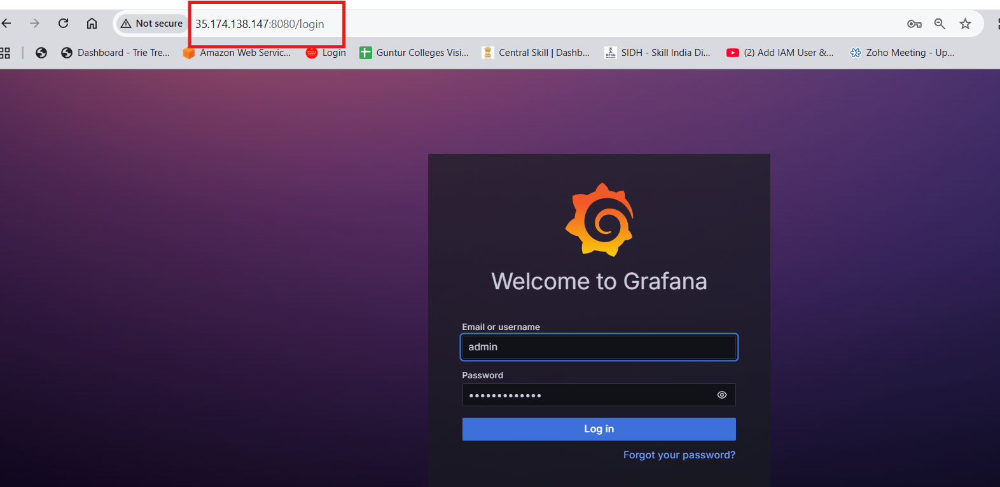
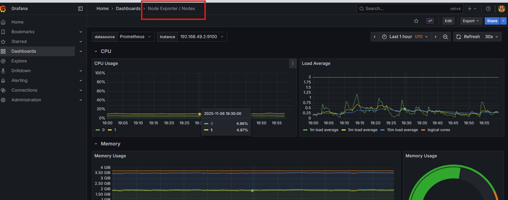
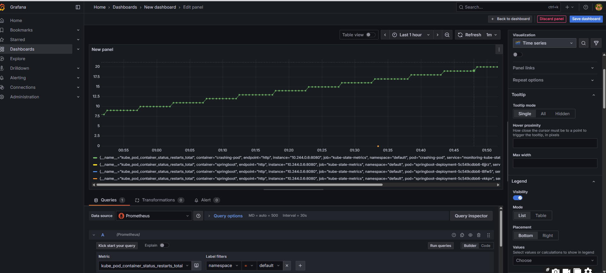
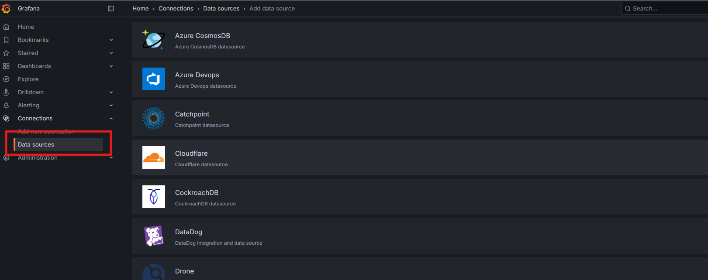

Grafana UI (Default Password: prom-operator)
```bash
kubectl port-forward service/monitoring-grafana -n monitoring 8080:80 --address 0.0.0.0
```
Access URL: http://<EC2-Public-IP>:8080



- To get password use 
```bash
kubectl get secret -n monitoring monitoring-grafana -o jsonpath="{.data.admin-password}" | base64 --decode ; echo
```


In grafana dashboard node exporter/nodes


custom dashboard


Add Data source/ connecting other tools

